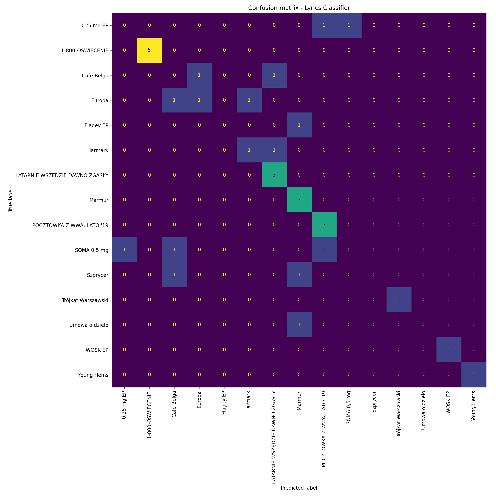

<h1 align="center">Lyrics Classifier</h1>

<p align="center">
  Klasyfikator albumów Taco Hemingwaya na podstawie tekstu utworu.
</p>

<p align="center">
  
  
  
  
</p>

## O projekcie

W tym projekcie rozwiązuję zadanie klasyfikacji tekstu: na podstawie lyrics
model przewiduje, z którego albumu pochodzi utwór. Zbudowałem mały, ale pełny
pipeline ML/NLP: od czyszczenia danych, przez trening i porównanie modeli, po
analizę błędów oraz raporty ułatwiające ocenę działania modelu.

Najważniejsze założenie: nie gonię wyłącznie za accuracy. Dataset jest mały i
nierówny, więc pokazuję świadomą ewaluację, baseline, macro F1, confusion
matrix i wpływ progu filtrowania albumów.

## Wyniki w skrócie

Domyślna konfiguracja używa 15 albumów i 164 utworów po filtrowaniu
`MIN_SONGS_PER_ALBUM = 4`.

| Metryka | Wynik |
|---|---:|
| CV accuracy mean | 0.6098 |
| CV accuracy std | 0.0622 |
| Test accuracy | 0.5455 |
| Test macro F1 | 0.4583 |
| Test weighted F1 | 0.4885 |
| Liczba klas | 15 |
| Liczba błędów na teście | 15 |

Najnowszy eksperyment TF-IDF pokazał mi, że wariant `unigrams_only` daje lepszy
wynik testowy (`macro F1 = 0.4989`) niż konfiguracja domyślna z bigramami
(`macro F1 = 0.4583`). Domyślnej konfiguracji jeszcze nie zmieniłem, bo warto
najpierw potwierdzić ten wynik na kolejnych eksperymentach.

## Podgląd ewaluacji

Macierz pomyłek dla domyślnej konfiguracji:

<p align="center">
  
</p>

Najczęściej przewidywane albumy wśród błędnych predykcji:

| Album przewidziany błędnie | Liczba |
|---|---:|
| `Marmur` | 5 |
| `Café Belga` | 3 |
| `POCZTÓWKA Z WWA, LATO '19` | 2 |
| `SOMA 0,5 mg` | 1 |
| `LATARNIE WSZĘDZIE DAWNO ZGASŁY` | 1 |

## Co pokazuję w projekcie

- klasyczny pipeline NLP: `TfidfVectorizer -> LogisticRegression`;
- baseline przez `DummyClassifier`;
- porównanie kilku modeli tekstowych;
- stratyfikowany train/test split;
- cross-validation przez `StratifiedKFold`;
- raporty `metrics.json`, `classification_report.txt`, `errors.csv`;
- agregację błędów w `error_summary.csv`;
- interpretowalność przez `top_features_by_album.csv`;
- eksperyment z progiem `min_songs`;
- eksperymenty z parametrami TF-IDF;
- CLI do powtarzalnych eksperymentów.

## Dane

Korzystam z pliku:

```text
data/lyrics_data.csv
```

Format danych:

```text
album;;title;;lyrics
```

Dataset zawiera 165 rekordów i 3 kolumny:

```text
album
title
lyrics
```

Po usunięciu pustych wartości oraz zastosowaniu domyślnego progu
`MIN_SONGS_PER_ALBUM = 4` do treningu trafia:

```text
15 albumów
164 utwory
```

Albumy użyte w domyślnej konfiguracji:

- `0,25 mg EP`
- `1-800-OŚWIECENIE`
- `Café Belga`
- `Europa`
- `Flagey EP`
- `Jarmark`
- `LATARNIE WSZĘDZIE DAWNO ZGASŁY`
- `Marmur`
- `POCZTÓWKA Z WWA, LATO '19`
- `SOMA 0,5 mg`
- `Szprycer`
- `Trójkąt Warszawski`
- `Umowa o dzieło`
- `WOSK EP`
- `Young Hems`

## Pipeline

Domyślnie trenuję model:

```text
TfidfVectorizer -> LogisticRegression
```

Najważniejsze elementy pipeline:

- czyszczenie braków w danych;
- usuwanie rekordów bez albumu lub tekstu;
- filtrowanie albumów według minimalnej liczby utworów;
- TF-IDF z unigramami i bigramami;
- `LogisticRegression(max_iter=2000, class_weight="balanced", solver="lbfgs")`;
- `train_test_split(..., stratify=y)`;
- `StratifiedKFold`;
- zapis modelu do `.joblib`;
- zapis raportów do `reports/`.

## Porównanie modeli

Wyniki zapisuję do:

```text
reports/model_comparison.csv
```

Aktualne porównanie przy `MIN_SONGS_PER_ALBUM = 4`:

| Model | CV accuracy mean | Test accuracy | Test macro F1 | Test weighted F1 |
|---|---:|---:|---:|---:|
| Logistic Regression | 0.6098 | 0.5455 | 0.4583 | 0.4885 |
| Linear SVC | 0.6159 | 0.5455 | 0.4286 | 0.4784 |
| Multinomial NB | 0.2073 | 0.1818 | 0.0847 | 0.0713 |
| Dummy Most Frequent | 0.1585 | 0.1515 | 0.0175 | 0.0399 |

`Logistic Regression` pozostaje najlepszym modelem referencyjnym, bo osiąga
najwyższe `test macro F1`. `LinearSVC` ma podobną accuracy, ale słabszy wynik
macro F1.

## Interpretowalność

Po treningu zapisuję:

```text
reports/top_features_by_album.csv
```

To raport z cechami TF-IDF o najwyższych wagach dla każdego albumu w modelu
głównym. Przykład:

| Album | Top cechy |
|---|---|
| `0,25 mg EP` | `quebonafide`, `refren quebonafide`, `zwrotka quebonafide` |
| `1-800-OŚWIECENIE` | `800`, `oświecenie`, `800 oświecenie` |

Ten raport nie jest dowodem przyczynowości, ale pomaga mi sprawdzić, czy model
opiera się na sensownych sygnałach tekstowych.

## Eksperyment `min_songs`

CLI pozwala mi porównać próg minimalnej liczby utworów na album bez edycji kodu.
Wyniki eksperymentu zapisuję w:

```text
reports/min_songs_comparison.csv
reports/min_songs_4/
reports/min_songs_5/
```

| Min songs | Albumy | Utwory | CV folds | Test accuracy | Test macro F1 | Błędy |
|---:|---:|---:|---:|---:|---:|---:|
| 4 | 15 | 164 | 4 | 0.5455 | 0.4583 | 15 |
| 5 | 14 | 160 | 5 | 0.6250 | 0.5391 | 12 |

Wariant `min_songs = 5` daje lepsze metryki, ale usuwa z zadania `Flagey EP`.
Traktuję to jako kompromis między liczbą klas a stabilnością ewaluacji.

## Eksperymenty TF-IDF

Skrypt zapisuje porównanie kilku konfiguracji TF-IDF do:

```text
reports/tfidf_experiments.csv
```

Aktualne wyniki:

| Eksperyment | N-gramy | min_df | max_features | sublinear_tf | Test accuracy | Test macro F1 |
|---|---:|---:|---:|---:|---:|---:|
| `unigrams_only` | 1-1 | 2 | 5000 | True | 0.6061 | 0.4989 |
| `no_sublinear_tf` | 1-2 | 2 | 5000 | False | 0.5758 | 0.4905 |
| `default` | 1-2 | 2 | 5000 | True | 0.5455 | 0.4583 |
| `max_features_3000` | 1-2 | 2 | 3000 | True | 0.5455 | 0.4578 |
| `min_df_1` | 1-2 | 1 | 5000 | True | 0.5455 | 0.4356 |

Najlepszy pojedynczy wynik testowy daje wariant unigramowy. Traktuję go jako
dobrego kandydata na kolejną konfigurację domyślną, ale przy tak małym zbiorze
warto traktować pojedynczy split ostrożnie.

## Kaggle

Notebook z pełnym przebiegiem analizy jest dostępny na Kaggle:

```text
https://www.kaggle.com/code/mateuszmachowski/taco-hemingway-album-classifier
```

Dataset:

```text
https://www.kaggle.com/datasets/b14ucky/taco-hemingway-lyrics
```

## Szybki start

Windows PowerShell:

```powershell
python -m venv .venv
.\.venv\Scripts\Activate.ps1
python -m pip install -e .
python train_model.py
python load_model.py
```

Linux / macOS:

```bash
python -m venv .venv
source .venv/bin/activate
python -m pip install -e .
python train_model.py
python load_model.py
```

## CLI

Przykłady:

```powershell
python train_model.py --min-songs 5 --output-dir reports\min_songs_5 --model-path artifacts\model_min_songs_5.joblib
python train_model.py --model linear_svc --output-dir reports\linear_svc
python train_model.py --test-size 0.25 --output-dir reports\test_size_025
```

Dostępne opcje:

```text
--data-path
--min-songs
--test-size
--model
--output-dir
--model-path
--random-state
--max-cv-splits
--tfidf-min-df
--tfidf-max-features
--tfidf-ngram-max
--no-sublinear-tf
```

## Testy

Dodałem mały zestaw testów, które sprawdzają krytyczne zachowania bez
testowania każdej drobnostki:

- filtrowanie albumów po minimalnej liczbie utworów;
- budowę pipeline TF-IDF + klasyfikator;
- mapowanie argumentów CLI na konfigurację treningu.

Uruchomienie:

```powershell
python -m pip install -e ".[dev]"
python -m pytest
```

## Raporty i artefakty

Po uruchomieniu `python train_model.py` generuję:

```text
reports/metrics.json
reports/classification_report.txt
reports/confusion_matrix.png
reports/errors.csv
reports/error_summary.csv
reports/evaluation_summary.txt
reports/model_comparison.csv
reports/top_features_by_album.csv
reports/tfidf_experiments.csv
artifacts/model_full_discography.joblib
```

Pliki `.joblib` są artefaktami generowanymi lokalnie i nie powinny być
commitowane.

## Struktura projektu

```text
.
├── data/
│   └── lyrics_data.csv
├── artifacts/
│   └── model_full_discography.joblib
├── reports/
│   ├── metrics.json
│   ├── classification_report.txt
│   ├── confusion_matrix.png
│   ├── errors.csv
│   ├── error_summary.csv
│   ├── evaluation_summary.txt
│   ├── model_comparison.csv
│   ├── top_features_by_album.csv
│   ├── tfidf_experiments.csv
│   ├── min_songs_comparison.csv
│   ├── min_songs_4/
│   └── min_songs_5/
├── src/
│   └── lyrics_classifier/
│       ├── __init__.py
│       ├── cli.py
│       ├── config.py
│       ├── data.py
│       ├── evaluation.py
│       ├── modeling.py
│       └── reports.py
├── train_model.py
├── load_model.py
├── pyproject.toml
├── requirements.txt
├── tests/
│   ├── test_cli.py
│   ├── test_data.py
│   └── test_modeling.py
└── README.md
```

## Ograniczenia

Dataset jest niewielki, a część albumów ma bardzo mało przykładów. Przykładowo
`Flagey EP` ma 4 utwory w całym zbiorze, więc przy progu `min_songs = 4` model
ma bardzo mało danych dla tej klasy.

Z tego powodu pojedynczy wynik na zbiorze testowym należy traktować ostrożnie.
Ważniejsze są:

- walidacja krzyżowa;
- macro F1;
- analiza błędów;
- confusion matrix;
- porównanie kilku modeli;
- jawne opisanie progu filtrowania albumów.

W tym projekcie ważniejsze od samej accuracy jest pokazanie pełnego procesu ML:
przygotowania danych, ewaluacji, analizy błędów i świadomego wyboru modelu.